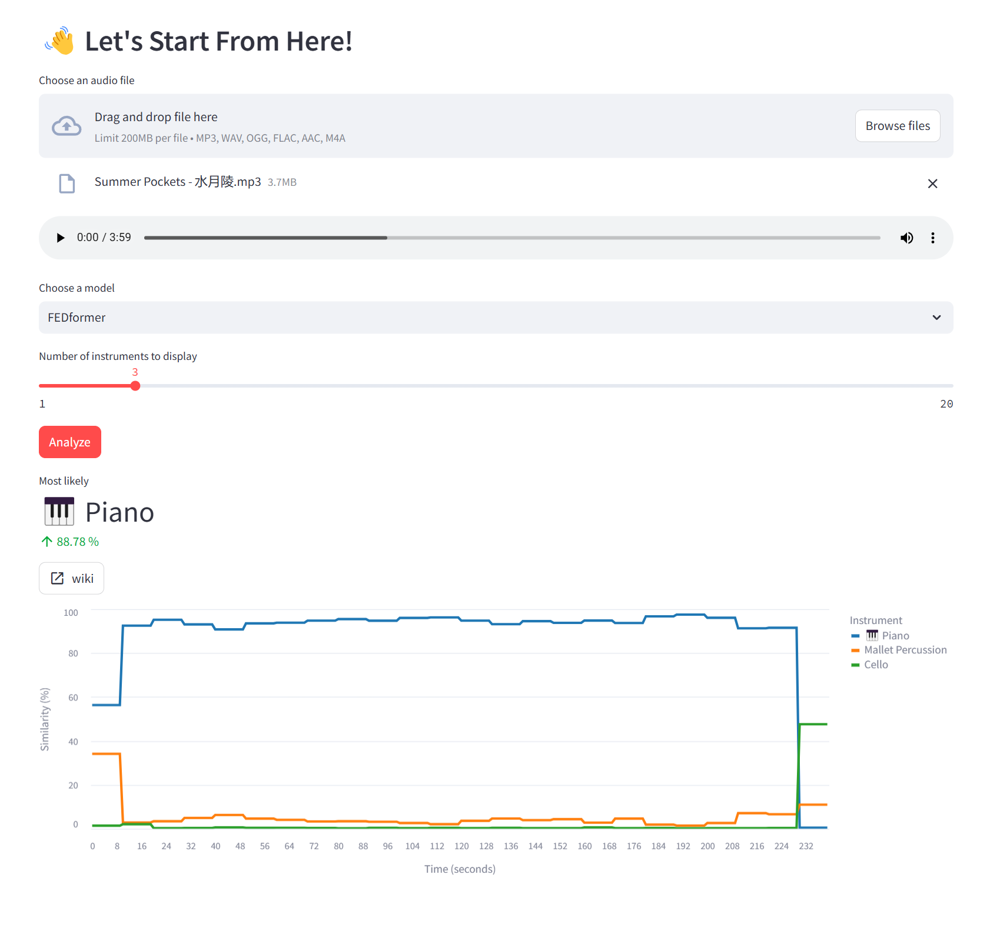

# 🎹 InsRec: Musical Instrument Recognition App

Using state-of-the-art 📈 time series analysis neural networks for musical instrument recognition!

🚀 Powered by [PyOmniTS](https://github.com/Ladbaby/PyOmniTS), the unified framework for time series analysis.

> [!IMPORTANT]
> Accuracy is not guaranteed! Refer to the benchmark section for model performance details.

## 📷 Screenshot



## ⏬ Installation

### From Source

1. Clone this repository and its submodules, then checkout to branch `InsRec` for backend submodule.

    ```shell
    git clone --recurse-submodules https://github.com/Ladbaby/InsRec
    cd InsRec/backend
    git checkout InsRec
    cd ..
    ```

2. Create a python virtual environment via the tool of your choice

    for example, using [Miniconda](https://docs.conda.io/en/latest/miniconda.html)/[Anaconda](https://www.anaconda.com/):

    ```shell
    conda create -n InsRec python=3.12
    conda activate InsRec
    ```

    > Python 3.11 & 3.12 have been tested. Other versions may also work.

3. Install dependencies in the created environment

    ```shell
    pip install -r backend/requirements.txt
    pip install -r requirements.txt
    ```

## 🚀 Usage

### Easy: Use Existing Model Weights

The web UI is launched via:

```shell
streamlit run main.py
```

or running `sh main.sh`.

During the first run, it will prompt you whether to download checkpoint files for models in the terminal.

### Advanced: Train a Model

Neural network training is powered by [PyOmniTS](https://github.com/Ladbaby/PyOmniTS) framework.

The training procedure for existing models on OpenMIC-2018 dataset is detailed here.

#### Obtain OpenMIC Dataset

- Download the dataset from [here](https://zenodo.org/records/1432913), and place the extracted result under `backend/storage/datasets/OpenMIC`.
Create the parent folder if not exists.
- Download the processed VGGish representations of corresponding audios from [huggingface](https://huggingface.co/datasets/Ladbaby/InsRec-datasets/blob/main/OpenMIC/processed/x_repr_times.npy), and place it under `backend/storage/datasets/OpenMIC/processed`

    > It's worth noting that these VGGish representations are different from the "X" in `backend/storage/datasets/OpenMIC/openmic-2018.npz`. Our representations are obtained using the pretrained [PyTorch VGGish pipeline](https://docs.pytorch.org/audio/master/generated/torchaudio.prototype.pipelines.VGGISH.html) and the PCA weights from [torchvggish](https://github.com/harritaylor/torchvggish/releases/download/v0.1/vggish_pca_params-970ea276.pth).

#### Train the Model

You may find experimental settings (e.g., learning rate, d_model) for the chosen model in its scripts under `backend/scripts/CHOSEN_MODEL/OpenMIC.sh`.

Start training by:

```shell
cd backend
sh scripts/CHOSEN_MODEL/OpenMIC.sh
```

Model weights `pytorch_model.bin` will be found under `backend/storage/results`

To infer using your trained weights instead, replace the `pytorch_model.bin` file under `backend/storage/pretrained/OpenMIC/CHOSEN_MODEL` folder with your own.

## 📊 Model Performance Benchmark

Test set performance on OpenMIC-2018 dataset:

|Model|Accuracy|Precision|Recall|F1
|---|---|---|---|---|
|Pyraformer|67.86|64.72|65.01|64.30
|Reformer|67.66|64.60|64.74|63.94
|Informer|67.40|64.23|64.06|63.38
|Nonstationary Transformer|66.88|64.42|64.09|63.46
|iTransformer|66.04|63.74|60.87|61.53
|TSMixer|65.47|62.27|60.80|60.82
|LightTS|65.26|62.42|60.32|60.68
|Mamba|65.05|61.89|61.52|60.95
|Transformer|64.53|61.43|64.00|61.08
|Raindrop|64.95|61.81|62.17|61.13
|FreTS|64.79|61.18|59.63|59.80
|FEDformer|64.74|60.83|60.32|59.81
|DLinear|64.43|62.39|59.53|59.76
|GRU-D|64.32|58.75|54.91|55.08
|TimesNet|64.17|61.19|60.62|60.03
|Linear|64.17|63.07|58.41|59.60
|Leddam|63.23|62.53|59.66|59.38
|mTAN|60.89|53.87|44.75|46.73
|SegRNN|58.70|60.02|50.77|53.23
|Autoformer|54.16|51.48|51.03|50.61
|PatchTST|45.63|43.01|41.91|41.27
|TiDE|36.35|34.18|27.93|29.38
|MICN|36.67|34.91|29.31|30.01
|Crossformer|21.72|1.09|5.00|1.78
|FiLM|21.72|1.09|5.00|1.78


Existing state-of-the-art time series models mainly learns in the time domain, while audios processing models primarily learns in the frequency domain. 
Also, audio (e.g., 16k every second) is far longer than any time series in research datasets (e.g., 720).
Therefore, [VGGish](https://docs.pytorch.org/audio/master/generated/torchaudio.prototype.pipelines.VGGISH.html) is currently used as the encoder to convert audio input as embeddings, and time series models take them as input instead (it makes little sense I know, but this is possibly the only way for painless adaptation).

Further improvement may require changing network architecture of time series models, such that VGGish embeddings are treated as representations instead of time series.
